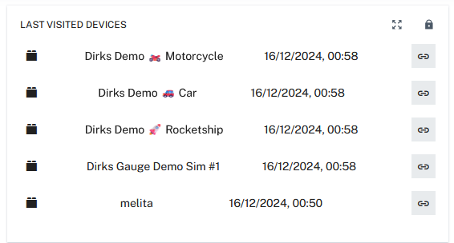

# Latest Devices Plugin

A **Cumulocity IoT** plugin that displays the most recently visited devices (with direct links) in both **Device Management** and **Cockpit**.

## Features

- **Recent Devices List**: Automatically shows your last visited devices.
- **Quick Navigation**: Click any device to open its details instantly.
- **Easy Configuration**: Pick which device settings to display via the widget settings.
- **Flexible Placement**: Works seamlessly in both Device Management and Cockpit.

## Advantages

This plugin saves time by letting you jump straight to frequently visited devices, keeps everything organized by tracking important device settings, and simplifies configuration through the built-in widget settings without requiring any external tools.

## Configuration

Open the widget’s settings to choose which device settings appear in the list.

## Support & Contributions

- **Issues**: Submit bugs or feature requests in the issue tracker.
- **Pull Requests**: Fork the repo and open a PR to contribute.

---

Enjoy effortless device tracking with the Latest Devices Plugin!

Changelog:
Release v 1.0.0 - First working plugin to show latest devices
